# MBNFS
Seizure type classification algorithm based on multi-dimensional brain  network feature selection

### 文件夹说明

+ bnfeature文件夹用于存放各个脑网络的网络特征（.mat）

+ epoch文件夹已经放了运行后的结果（预处理后的等长EEG发作片段，并不是所有发作片段，论文中使用的随机抽取的733个.mat文件）

+ MI文件夹已经放了运行后的结果（对epoch文件夹中所有文件进行计算得到的MI矩阵，733个.mat文件）

+ MI_temp文件夹用于存放迭代过程中删除节点后的MI矩阵，现在放着最后一次迭代结束后的MI矩阵

+ tuh_eeg_seizure文件夹存放原始EEG数据集

+ tuh_eeg_seizure_classData文件夹用于存放原始EEG数据集中发作的EEG数据（第一次运行没有会自动生成）

+ 代码放在code文件夹中，code文件夹中的requirements.txt文件存放着环境版本

+ lda.pkl 和 model.pkl为保存的模型，result.json为最后一次迭代是生成模型的性能指标，这三个文件都是迭代结束后得到的

### 代码说明

​	以下提到的小节和论文中小节对应。

​	main.py文件中，train_model (edfFileDir) 函数为癫痫类型分类算法，输入：脑电原始数据集路径，输出：模型路径。因为epoch文件夹和MI文件夹已经存放了结果，所以train_model函数中注释了4行，如果要重新运行可以取消注释，注意论文中只用了733个片段，重新运行的话，epoch文件夹中应该有23457个.mat文件。其中，edfFileDir和SaveRootDir需要根据本地位置进行修改。

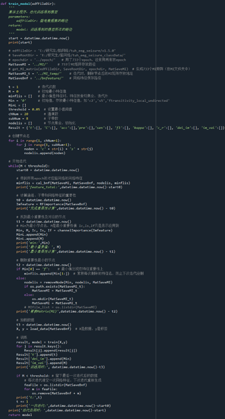

​	以下详解介绍main.py文件中的train_model(edfFileDir)函数的算法流程，首先，get_MI_matrix (edfFileDir, SaveRootDir, epochdir, MatSaveMI) 函数（在get_MI.py中）为脑电数据的预处理，其中包含了脑电数据的切分、WPT处理和获得互信息（MI）矩阵。

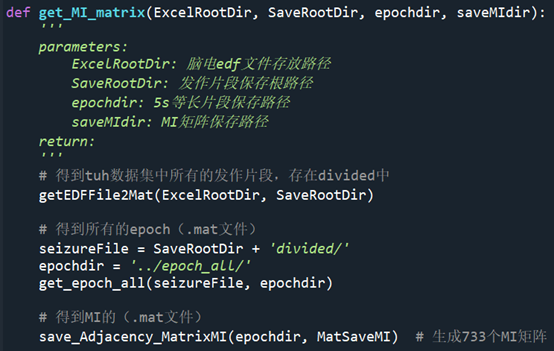

​	getEDFFile2Mat (ExcelRootDir, SaveRootDir) 函数为截取发作片段操作，get_epoch_all(seizureFile, epochdir)函数为切分等长脑电片段操作，不详细介绍。save_Adjacency_MatrixMI (epochdir, MatSaveMI)函数为得到等长脑电片段的MI矩阵，输入为等长脑电片段路径，输出MI矩阵保存在mat文件中。详细过程如下：

### WPT

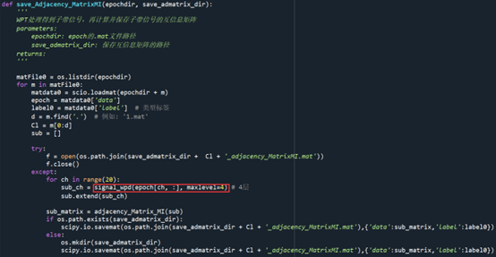

​	下图为WPD.py中signal_wpd函数分别得到脑电信号各个通道的8个子带信号。之后将返回得到的子带信号输入到get_MI.py中save_Adjacency_MatrixMI函数。

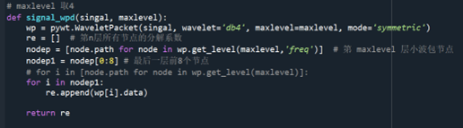

### 脑网络的构建

​	get_MI.py中save_Adjacency_MatrixMI函数，得到各个脑电信号片段的MI矩阵并保存为.mat文件。之后将返回得到的.mat文件输入到brainNetwork.py中brainigraph函数（该函数在bnFeature.py中cal_bnf(MatSaveMI, MatSaveBnf, nodelis, minflis)函数中调用）。运行完save_Adjacency_MatrixMI函数后main.py中的test_model函数继续执行。

​	main.py中，下列为初始节点。chNum为通道数，20。subNum为子带数，8。之后开始迭代，cal_bnf(MatSaveMI, MatSaveBnf, nodelis, minflis)函数（在bnFeature.py中），输入：保存MI矩阵的路径、网络特征保存路径、节点名和去除特征名（每次迭代可能删除的最小重要性值特征），输出：各个网络的特征值保存在mat文件中和最小重要性特征集（之后迭代，每次都要删除之前的最小重要性值的特征）。

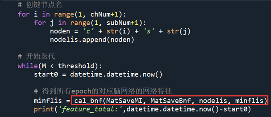

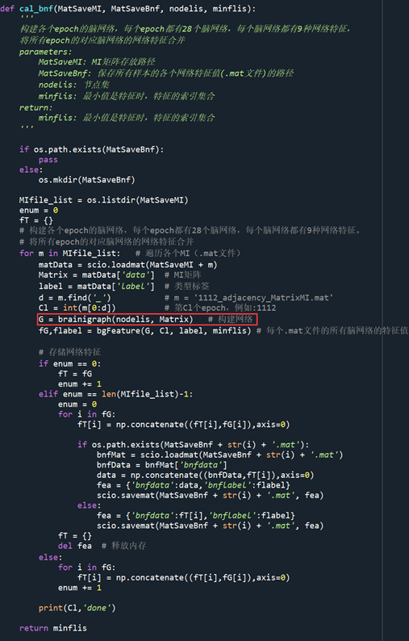

brainNetwork.py中brainigraph函数根据nodelis中的节点和MI矩阵构建脑网络。之后将脑网络输入到bnFeature.py中bgFeature函数。

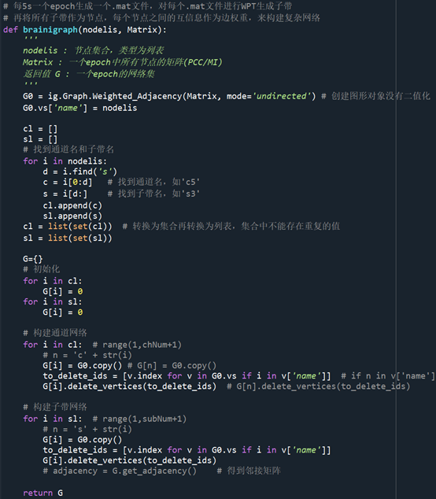

### 脑网络特征的提取

​	bnFeature.py中bgFeature函数计算各个脑网络的8个网络特征。之后将返回的网络特征输入到Importance.py中RFimportance函数。

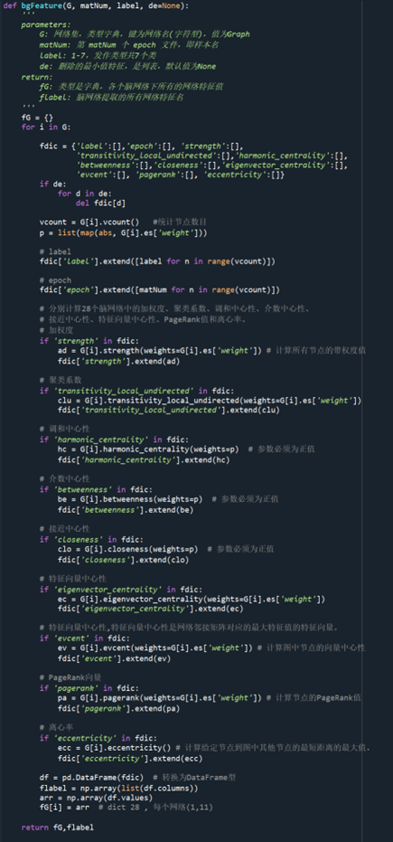

​	在每个脑网络中，提取了加权度、聚类系数、调和中心性、介数中心性、紧密中心性、特征向量中心性、PageRank和偏心率等八个网络特征。

### 多维脑网络特征选择

​	main.py中继续运行到RFimportance函数。

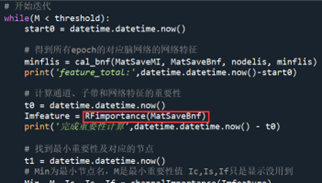

​	Importance.py中RFimportance函数对应论文2.5.1节基于RF的贡献计算中的内容。将返回得到的重要性值输入到Importance.py中channelImportance函数。

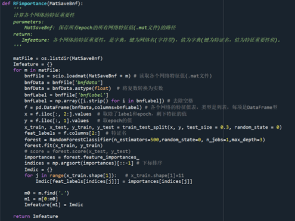

​	Importance.py中channelImportance函数对应论文2.5.2节通道贡献、2.5.3节子带贡献和2.5.4节网络特征贡献，并且对应2.5.5节三维迭代特征选择中的步骤3和步骤4。之后判断得到的最小重要性值是否满足结束迭代的条件，若不满足则回到brainNetwork.py中brainigraph函数，若满足则跳出迭代得到模型。

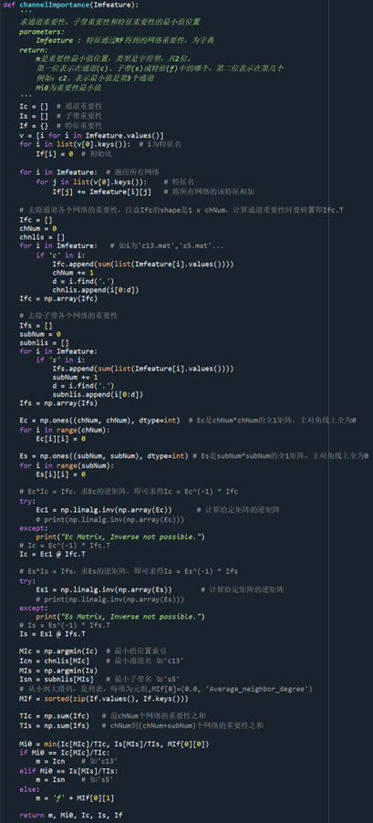

​	main.py中的train_model函数开始迭代部分，下图所示内容为2.5.5节三维迭代特征选择的完整步骤，且每次迭代完都会训练模型查看指标数据。

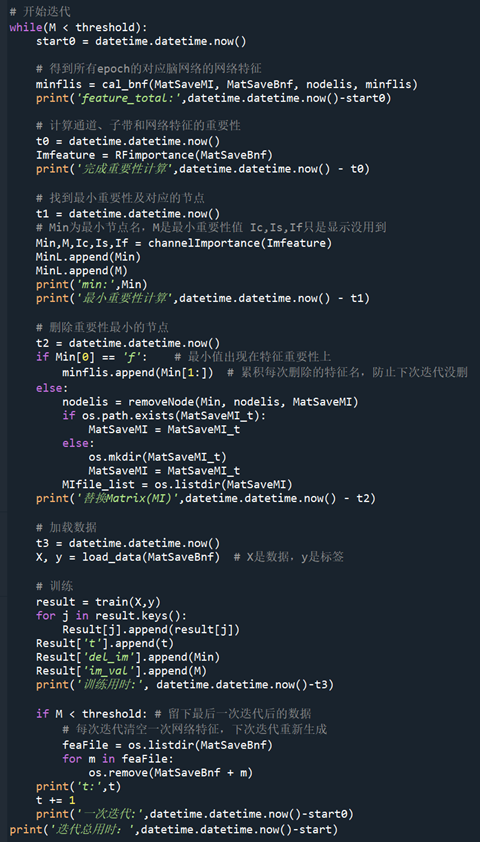

### RF分类

​	main.py中迭代部分中的训练部分。

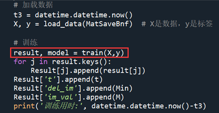

​	trainProcrc.py中的train函数为RF分类训练模型函数，其中包含5折交叉验证。输入值为每次迭代后bnFeature.py中bgFeature函数生成的特征数据，返回指标保存到.json文件中。

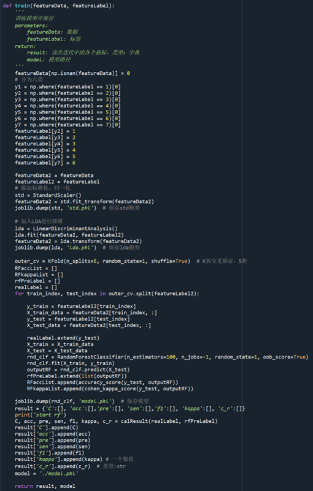

​	通过RF和*k*-fold交叉验证获得了分类结果。RF是一种融合多个决策树的机器学习算法。它构建了多个决策树，并通过随机选择特征和数据集来合并它们的预测进行分类。它在癫痫类型检测中表现出了优异的性能。设置RF分类器中的决策树的数量为100。

### 指标评估

​	trainProcrc.py中的calResult函数计算并保存指标结果。在train函数中被调用。

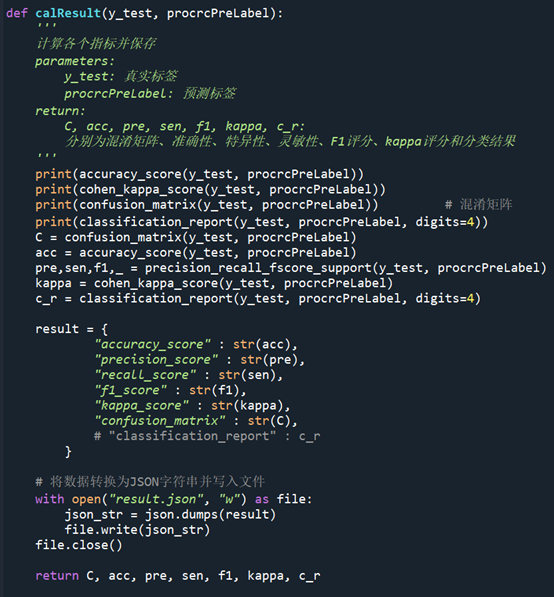